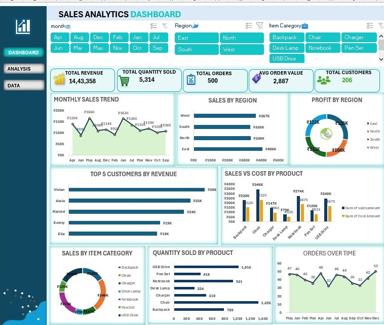

# Sales Analytics Dashboard

## 📊 Project Overview

This project is an interactive **Sales Analytics Dashboard created using Microsoft Excel**.

The dashboard provides a clear view of sales performance, product performance, regional sales, customers, revenue, quantity, and order trends.

## 📌 Key Features

- Total Revenue
- Total Quantity Sold
- Total Orders
- Average Order Value
- Total Customers
- Monthly Sales Trend
- Sales by Region
- Profit by Region
- Top 5 Customers by Revenue
- Sales vs Cost by Product
- Sales by Item Category
- Quantity Sold by Product
- Orders Over Time

## 🎛️ Interactive Filters

- Month
- Region
- Item Category

## 🛠️ Tools Used

- Microsoft Excel
- PivotTables
- PivotCharts
- Slicers
- Excel Formulas
- Dashboard Design

## 📷 Dashboard Preview

## 🎯 Objective

The objective of this dashboard is to help understand sales performance and identify trends in revenue, products, customers, regions, and orders for better business decision-making.
